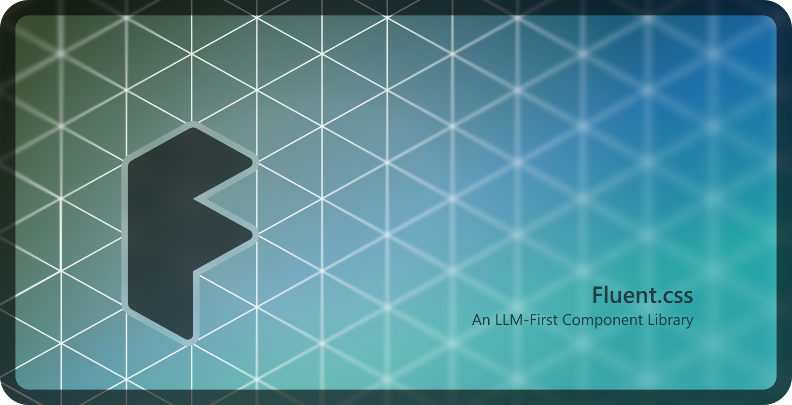

# Fluent.css

**An attempt at an LLM-first design system**

Fluent.css automatically styles native HTML elements into [Microsoft Fluent Design Language](https://fluent2.microsoft.design/). It provides utilities for theming and class-based components with a minimal API designed so the full documentation fits in an LLM prompt.

The design system consists of only two artifacts: an `llms.txt` documentation file and an imported `fluent.css` file. This portable design allows the library to be integrated in any code gen platform or development environment.

**Tailwind Integration** - Fluent.css uses Tailwind syntax and integrates as a component library into Tailwind's `theme`, `components`, and `utilities` css `@layer`s. It also provides css component classes, utility classes, and css variables.

**Why Tailwind syntax?** LLMs produce significantly better UI output with Tailwind syntax (see [mirai-css-prompts](https://github.com/aipx-proto/mirai-css-prompts) for experimental results). All AI app generators (bolt, Lovable, Stitch, V0, OnLook) use Tailwind, likely for this reason.

**Tailwind is not required** - this library works standalone with zero dependencies.

[Components Demo](https://aipx-proto.github.io/fluent-css/) / [LLMs.txt Documentation](./llms.txt)

## Usage
1. Feed your model the LLMs.txt: [`https://esm.sh/gh/aipx-proto/fluent-css@main/llms.txt?raw`](https://esm.sh/gh/aipx-proto/fluent-css@main/llms.txt?raw)

2. Import the css from CDN in your code:

   ```
   <link rel="stylesheet" href="https://esm.sh/gh/aipx-proto/fluent-css@main/build/fluent.css?raw" />
   ```

3. Ask the model to write HTML UI code.

### See [LLMs.txt](./llms.txt) for complete documentation.

## Development

```bash
npm install
npm run dev
```

Then open http://localhost:8080

### Build Process

PostCSS builds `styles/index.css` into `build/fluent.css` with these steps:

- **No default scanning**: Tailwind uses `source(none)` directive for explicit inclusion only
- **Custom properties extraction**: A custom PostCSS plugin `extract-custom-properties` extracts all `--custom-properties` from `styles/` and includes them as CSS variables, then removes the temporary rules with `css-byebye`. This _tricks_ tailwind into including all our properties in the output.
- **Utility overrides**: Files in `styles/utilities/` override default Tailwind utilities to prevent unnecessary `--tw-vars`

A second script generates `build/fluent.tailwind.css` for optimized of integrating into Tailwind builds. The usage of this file has not been designed yet. (Copy+Paste to try it out)

---

## TODOs

### Bugs & Improvements

- the disabled transparent button has a background
- use padding and absolute positions for the marker in `details summary` instead of flex? Or use `float:right;`?
- firefox & safari support? (for input pseudo elements)
- intent - info, brand, success, warning, danger
- publish to npm
- add versioning
- icons for input types - search, date, time, numeric
- icon support: vibe-icon

### Icons?

- icons with svg use external
- with [fluent icons font and css file](https://github.com/microsoft/fluentui-system-icons/blob/cd860cfdb9c60f6b731f6164b21e04909b23178e/fonts/FluentSystemIcons-Resizable.css)?
- Icons in input: wrapper element that z-indexes input at the back and a before and after element for icons and buttons
- with web-component

### Components

- Naming conventions from tailwind component libraries
  - tailwind v3 components (which i can find no record of)
  - [Daisy UI](https://daisyui.com/)
  - Fluent: [React](https://react.fluentui.dev/), [General](https://fluent2.microsoft.design/), [Web Component](https://web-components.fluentui.dev/), [Theme](https://react.fluentui.dev/iframe.html?viewMode=docs&id=theme-theme-designer--docs)
- Format - .component .component-variant .utility-variant
  - .size-sm, .size-md, .size-lg (.size-xl, .size-xs)
  - .type-primary, .type-outline, .type-subtle, .type-transparent (.type-ghost)
  - .intent-info, .intent-brand, .intent-success, .intent-warning, .intent-danger
  - .selected, .disabled, .icon-only
  - .tab, .tabs, .tabs-vertical
  - .btn, button, .btn-group, a.btn, select.btn, button.link (split-button, menu-button?)
  - .input, input
  - checkbox
  - radio
  - input range - (aka slider)
  - .switch - input[type="checkbox"] (aka toggle)
  - .spinner - progress[indeterminate] (aka progress bar)
  - .dialog - dialog - .dialog-dismiss-btn (aka modal)
  - .select - select select.btn select.input (aka dropdown)
  - details, summary (aka accordion) .marker-end
  - [popover] (.tooltip) .popover-position
  - .menu-group (.menu)
  - table .table-interactive, tr.table-row-interactive, th.table-cell-interactive tr.selected (aka data grid)
  - a .link (aka link) a.intent-info
  - .icon, .icon-emoji
  - NEXT
    - .field
    - .badge
    - .breadcrumbs .divider
    - .avatar?
    - .message (aka message bar, notice)
    - .skeleton
    - .dialog-drawer
    - table interactive
